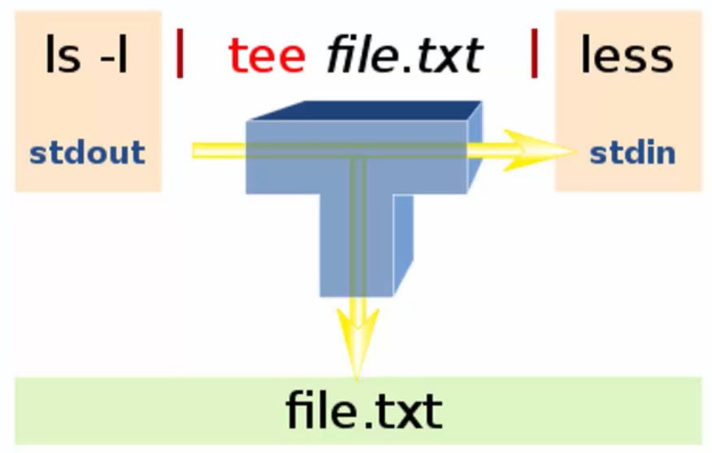
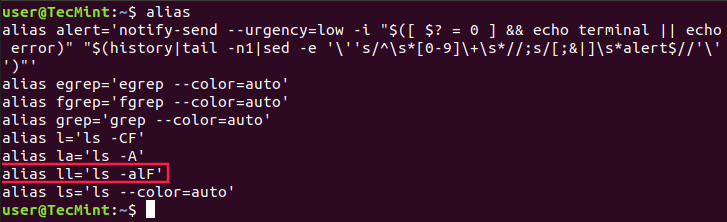

# Command Bsics
## 1.Command Structure
The general command structure goes like this.
1. you type out the command name. like `date` or `echo`.
2. Then you give the comments of options to customize its behavior.
3. Then you give the command some inputs to actually operate on.

`command [-flag(s)] [-option(s) [value]] [argument(s)]`

### 1.1.Command Name
The first part is the command name. The command is a program itself. By command name shell know what program must be run. Shell search for that program on something called Shell's path which is just a list of folders that contain programs. Shell's path can be seen by typing `echo $PATH`. We can see the folder the command is stored in by using the `which` command (find command path):
- `which cal` --> `/usr/bin/cal`

## 2.Linux Manual
The **man pages** is used for help of using commands. To see the manual for a command: `man command`:
- `man which`

**Note**: in manual pages:
- Anything inside `<>` is **mandatory**.
- Anything inside `[]` is **optional**
    - For example:
        - in `which [-a] <something>`, `-a` is optional but `something` is mandatory.
        - in `ls [OPTION]... [FILE]...` everything is optional and only `ls` is mandatory.

- `|` inside `[]` means `or` which means you have to pick one of them not both. For example in `[-a | -f]` using `-af` is invalid

## 3.Command Input & Output


**By default** standard output will lead to terminal. We can **redirect** the output data streams. Similarly, standard input is by default connected to the keyboard. So it can be redirected as well. We can pass the standard output from one command to the standard input of another then pass the standard output of that second command to the standard input  of the third command and so on. Connecting outputs to inputs in this way is known as **piping** together commands.

### Examples
- `cat`:  `cat` needs standard input.
- `cat 1> output.txt`: Every data stream has a name and a number associated with it.
    - Standard Input is number zero.
    - Standard output is number one.
    - Standard error is number two.

Here, we are redirecting or changing the destination of standard output because standard output is number one.

- `cat -k bla 2> error.txt`: Redirect standard error data stream to error.txt
- `cat 0< input.txt 1> output.txt 2> error.txt`

**Note:**
- You don't actually even need to put the number 1 in `cat 1> output.txt` (default for output: 1).
- You don't actually even need to put the number 0 in `cat 0< input.txt`> (default for input: 0).
- Use two arrows to write to a file again using redirection without truncating it (`cat 1>> output.txt`)

### Summary
- There are two ways to get data into commands and two ways to get data out.
    1. Command line arguments
    3. Standard Input
    2. Standard Output
    4. Standard Error
- Standard Input, Standard Output, and Standard Error are Standard Data Streams.
- Data streams can be redirected from their default locations to wherever you wish.
- You can redirect the standard output of one command to the standard input of another in a process know as **piping**.
- Using redirection you can control where those streams **flow**.
    - Standard Input: 0
    - Standard Output: 1
    - Standard Error: 2
- `>` will overwrite a file before writing it.
- `>>` will append to what's already there.

## 4.Piping

**Piping** is all about connecting standard output of one command to standard input of another command. This can be done by using `|`:
- `date | cut --delimiter " " --fields 1`

Remember the data can't really go two places at once.

- `tee` Command: We can save the information into a file and at the same time pass it down into the pipeline. Normal redirection break pipeline but by using the `tee` command we can save data but still keep pipeline flowing. So, we can pass data through pipeline but also take snapshots of the data as it flows through and save those snapshots into a file.


`tee` - read from standard input and write to standard output and files.

- `date | tee fulldate.txt | cut --delimiter " " --fields 1`

We can also send the standard output to a file:
- `date | tee fulldate.txt | cut --delimiter " " --fields 1 > today.txt`

- `xarg` Command: `echo` doesn't accept standard input. So the `date | echo` won't work. the key is to convert the data from standard input into command line arguments so the command can continue to work like normal.

- `date | xargs echo`
- `date | xargs echo "hello world"`
- `date | cut --delimiter " " --fields | xargs echo`

`rm` is another command that delets files and directories:
- `rm file`
- `rm -r directory`

This does not work to delete files:
- `cat filestodelete.txt | rm`

But this workds:
- `cat filestodelete.txt | xargs rm`

It's as if we run this command:
- `rm file_1.txt file_2.txt`

### Summary
- Piping connects **STDOUT** of one command to **STDIN** of another.
- Redirection of **STDOUT** breaks pipelines.
- To save a data snapshot without breaking pipelines, use the `tee` command.
- If a command does not accept **STDIN**, but you want to pipt to it, use `xargs`.
- Command you use with `xargs` can still have their own arguments.

## 5.Aliases

Linux users often need to use one command over and over again. We can create **aliases** for our most used commands. **Aliases** are like custom shortcuts used to represent a command (or set of commands) executed with or without custom options.

### 5.1.List Currently Defined Aliases in Linux
We can see a list of defined aliases on our profile by simply executing `alias` command.



### 5.2.Create Aliases in Linux

We can create two types of aliases – temporary ones and permanent.

- Creating Temporary Aliases: Type the word alias then use the name you wish to use to execute a command followed by "=" sign and quote the command you wish to alias.
    - `alias shortName="your custom command here"` e.g: `alias ls="ls -l"`

- Creating Permanent Aliases: To keep aliases between sessions, we can save them in our user’s shell configuration profile file. This can be:

```bash
Bash – ~/.bashrc
ZSH – ~/.zshrc
Fish – ~/.config/fish/config.fish
```

The syntax you should use is practically the same as creating a temporary alias. So for example, in bash, you can open `.bashrc` file like this:

`code ~/.bashrc`

Find a place in the file, where you want to keep the aliases.

```bash
# my custom aliases
alias home="ssh -i ~/.ssh/mykep.pem tecmint@192.168.0.100"
alias ll="ls -alF"
```

**Note:** If you are using [zsh], then you should open `~/.zshrc` file.


### Summary

- An alias is a custom nickname for a command or pipeline.
- aliases are accessible when you restart your terminal.

## 6.Wildcards

- `*` (Asterisk): This can represent any number of characters (zero or more characters). Now wildcards are basically special symbols that the shell interprets to have a special meaning. The usage of wildcards is to build up powerful patterns known as regular expressions so we can say something like hey linux make this command act on anything that matches this pattern. one of the most used wildcards is the asterisk. **Star wildcard matches anything.**

```bash
$user@computer-name:~$ ls D*
file1.txt file2.txt file3.txt
```

and `ls *` will match everything and will show the contents of all directories.

**Note:** Wildcards are case sensitive. So `ls D*` and `ls d*` will have different results.

If you want to list all text file:

```bash
$user@computer-name:~$ ls *.txt
file1.txt file2.txt file3.txt file4.txt file5.txt
```

- `?` (Question Mark): This can represent any single character. If you specified something at the command line like `hd?` GNU/Linux would look for `hda`, `hdb`, `hdc` and every other letter/number between `a-z`, `0-9`.

```bash
$user@computer-name:~$ ls ???e.txt
file1.txt file2.txt file3.txt file4.txt file5.txt
```

- `[]` (Square Brackets): Specifies a range. If you did `m[a,o,u]m` it can become: `mam`, `mum`, `mom` if you did: `m[a-d]m` it can become anything that starts and ends with `m` and has any character `a` to `d` inbetween. For example, these would work: `mam`, `mbm`, `mcm`, `mdm`. This kind of wildcard specifies an **or** relationship (you only need one to match).

```bash
$user@computer-name:~$ ls file[1-3].txt
file1.txt  file2.txt  file3.txt
$user@computer-name:~$ ls file[245].txt
file2.txt  file4.txt  file5.txt
$user@computer-name:~$ ls file[0-9][0-9].txt
file11.txt
```

**Note:** You can have combinations of capital letters, numbers, etc. such as `file[a-zA-Z0-9].txt`

- `{}` (Curly Brackets): Terms are separated by commas and each term must be the name of something or a wildcard. This wildcard will copy anything that matches either wildcard(s), or exact name(s) (an `or` relationship, one or the other).

For example, `ls {*.txt,*.png}` matches all files with either `.txt` or `.png` extension.
```bash
$user@computer-name:~$ ls {*.txt,*.png}
file1.txt file2.txt  file3.txt  file4.txt  file5.txt  image1.png  image2.png  image3.png
```

- `\` (backslash): Is used as an **escape** character, i.e. to protect a subsequent special character. Thus, `\\` searches for a backslash. Note you may need to use quotation marks and backslash(es).

- `[^]`: This construct is similar to the `[ ]` construct, except rather than matching any characters inside the brackets, it'll match any character, as long as it is not listed between the `[ and ]`. This is a logical NOT. For example `rm myfile[^9]` will remove all `myfiles*` (ie. `myfiles1`, `myfiles2` etc) but won't remove a file with the number 9 anywhere within it's name.

```bash
$user@computer-name:~$ ls file[^2].txt
file1.txt  file3.txt  file4.txt  file5.txt
$user@computer-name:~$ ls file[^2-4].txt
file1.txt file5.txt
```

### Summary
- Wildcards are used to build patterns called "regular expression"
- Anything that matches the pattern will be passed as a command line argument to a command.
- Covered wildcards:
    - `*`
    - `?`
    - `[]`
    - `{}`
    - `[^]`

# File basics

## 1.File Extensions
In linux, file extensions don't matter and don't determine file type. Linux reads a piece of code inserted at the top of file (header) that serves as a kind of label. So changing just the name of the file won't make a difference because that file header won't have changed. The installed extra programs on top of the operating system might require the file to have a certain format or the file extensions in order to open them but the operating system itself does not care. 

In linux, `file` command will tell us basically what type of file we are dealing with.

```bash
$user@computer-name:~$ file image.png
image.PNG: PNG image data, 1913 x 1086, 8-bit/color RGBA, non-interlaced
```

### Summary
- Use the `file` command to know what type of file you are dealing with.
- You can name files whatever you want in linux (even `.blahblah`).
- Try not to confuse third party softwares.

The shell tells where we currently are with **shell prompt** and the shell prompt is everything up to the dollar sign.

```bash
$user@computer-name:~$
```
First of all it tells you the user who is logged in which is `user` on this computer. Then you have the name of the computer which is `computer-name`. And then you `~` that's called Tilda which is a short way of representing the current user's home directory.

- `pwd`: **print working directory**.

```bash
$user@computer-name:~$ pwd
/home/user
```

- `ls`: list --> list of files in a directory.

|Command|Description|
|:--|:--|
|`ls`|List of files/directories in a directory|
|`ls -F`|List files/directories with classification (directories appear with `/` at the end)|
|`ls -l`|List of files/directories in **long format**|
|`ls -lh`|List of files/directories in **human readable** long format (4096 will appear as 4K)|
|`ls -a`|List of **all** (including hidden) files/directories|

**Note:** Hidden files/directories start with a dot: `.`

- `cd`: change directory.

**Note:**
- You can use **full path** (start at the base `/` directory such as `/home/user/`) or **relative path** (start at the current directory such as `./user`).
- `.` means the current directory.
- `..` means the parent folder or the folder above where we currently are.
- `cd .` stays in the same directory.
- `cd ..` changes directory to the parent directory.
- Press tab for auto completion. For example type `cd ~/Do` and press tab to receive two suggestions.

List of files/directories in long format:


### Summary
- You can use `pwd` command to see the path to where on the file system the shell is currently operating.
- You use `ls` to see what's around you.
- You can use the `cd` command to move to a new location on the file system.
- **Absolute Path** start at the base (`/`) directory.
- **Relative Path** start from the current directory.
- Every directory has the `.` (current directory) and `..` (parent directory) hidden folders.
- **Tab Auto Completion** is a really usefull technique to speed up typing and avoid errors.

## 3.Creating Files and Directories

- `touch`: create new empty files.

```bash
$user@computer-name:~$ touch file1.txt
$user@computer-name:~$ touch /home/user/file1.txt
```

You can directly create file and put contents in it with `echo`:
```bash
$user@computer-name:~$ echo "Hello World!" > hello.txt
```

- `mkdir`--> **make directory**: create or make new directories.

```bash
$user@computer-name:~$ mkdir newfolder
$user@computer-name:~$ touch /home/user/newfolder
```

`-p` option is used to create several new neated directory in one go:
```bash
$user@computer-name:~$ mkdir -p dir1/dir2/dir3
```

**Note:** Try to avoid having spaces in directory/file names. Instead use `_`. If you insist on having spaces, use quotations:
```bash
$user@computer-name:~$ mkdir "new folder"
```

### 3.1.Brace Expansion
Brace expansion is a mechanism by which arbitrary strings may be generated. We create all these directories in `project` directory:
```bash
$user@computer-name:~$ mkdir project
$user@computer-name:~$ cd prject
$user@computer-name:~$ mkdir {jan,feb,mar,apr,may,jun,july,aug,sep,oct,nov,dec}_{2017,2018,2019,2020,2021,2022}
```

You can then create `file1.txt` to `file100.txt` in each directory.
```bash
$user@computer-name:~$ touch {jan,feb,mar,apr,may,jun,july,aug,sep,oct,nov,dec}_{2017,2018,2019,2020,2021,2022}/file{1..100}.txt
```

Brace expansion isn't only possible for the `touch` and `mkdir` commands. It's actually usable across the whole shelf.
```bash
$user@computer-name:~$ ls {jan,feb,mar,apr,may,jun,july,aug,sep,oct,nov,dec}_{2017,2018}
```

## 4.Deleting File and Directories

- `rm` command for Deleting Files
```bash
$user@computer-name:~$ rm file1.txt
$user@computer-name:~$ rm file2.txt file2.txt /home/user/file3.txt
$user@computer-name:~$ rm file*.txt     # deletes with wildcard
$user@computer-name:~$ rm *.png         # deletes all .png files
$user@computer-name:~$ rm *             # deletes everything
```

- `-r` option used to delete directories:
```bash
$user@computer-name:~$ rm -r dir1
```

**Note:** To ask shell to prompt before every removal, add `-i` option (interactive option).
```bash
$user@computer-name:~$ touch delme/deleteme{1,2,3}/file{1,2,3}
$user@computer-name:~$ rm -ri delme
rm: descend into directory 'delme'?
rm: descend into directory 'delme/deleteme1'?
rm: remove directory 'delme/deleteme1/file1'?
...
```

- `rmdir` command only removes empty directories.

```bash
$user@computer-name:~$ rmdir delme
rmdir: failed to remove 'delme': Directory not empty
```

### Summary
- The `rm` command needs `-r` option to delete folders (Be careful!).
- The `i` option will allow the `rm` command to be **interactive** when deleting.
- The `rmdir` command will only delete folders that are empty.

## 5.Copying, Moving, Renaming

- **Copy**: The `cp` command handles all the copying of files and folders in Linux.

- `cp <source_file> <dest_file>` for files
- `cp -r <source_dir> <dest_dir>` for directories.

```bash
$user@computer-name:~$ cp file1.txt /home/user/file_1_copy.txt
$user@computer-name:~$ cp -r dir_1 dir_1_copy
```

- **Rename and move**: `mv`

```bash
$user@computer-name:~$ mv file1.txt file_renamed.txt
```

```bash
$user@computer-name:~$ mv file1.txt dest
```

For directories, add `-r` option:
```bash
$user@computer-name:~$ mv -r dir dir_renamed
$user@computer-name:~$ mv -r dir dest/dir
```

You can use wildcards: Move everything in `dir` to desktop:
```bash
$user@computer-name:~$ mv -r dir/* /home/user/Desktop
```

### Summary
- `cp <what you want to copy> <Destination>`
- `mv <what you want to move> <Destination>`
- `mv <what you want to rename> <New Name + Location>`
- **Create** using `touch` and `mkdir` commands.
- **Delete** using the `rm` and `rmdir` commands.
- **Copy** using the `cp` command.
- **Move** and Rename using the `mv` command.
