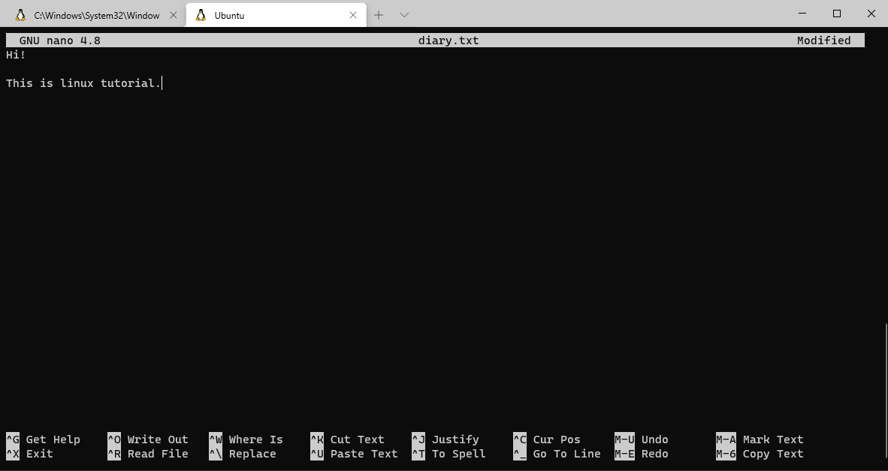
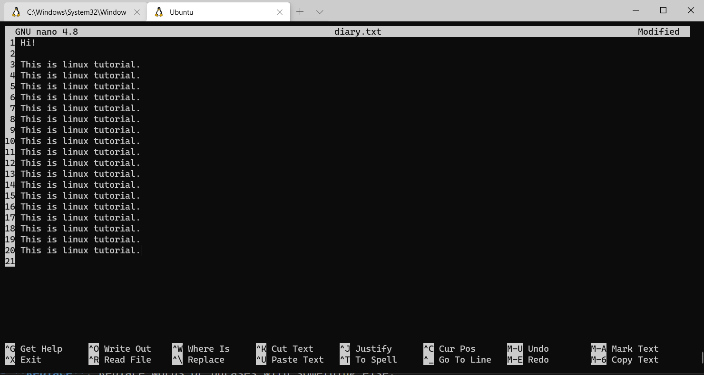

# Viewing Files
Linux provides a number of commands for viewing files. `cat`, `more` and `less` commands.

- **`cat`**: The cat command is the simplest way to view the contents of a file.
```bash
cat file.txt
```

If want to number the lines in the output, We can do this by using the `-n` option:
```bash
cat -n file.txt
```

You can concatenate many files and display them:
```bash
cat file_1.txt file_2.txt
```

- **`tac` and `rev`**: `tac` is the reverse version of `cat` horizontally (linewise) meaning that the last line will be displayed first and the first line last.
```bash
tac file.txt
```

`rev` is the reverse version of `cat` vertically (characterwise) meaning that the last character will be displayed first and the first character last.
```bash
tac file.txt
```

- **`more`**: The `cat` command is good for small files. But, if the file is large, we’ll only see the last screen worth of content. The `more` command displays the contents of the file one screen at a time for large files. If the contents of the file fit a single screen, the output will be the same as the `cat` command. The cursor will stay at the end of this text. Then, we can scroll through the contents of the file using the **Enter** key, one line at a time. We can also scroll through the file page by page by using the **Space bar**. And to scroll back to the previous page, we can use the **b** key. We’ll use the **q** key to go back to the command prompt.
```bash
more large-file.txt
```

The `more` command can also be used to view multiple files. We just have to list each of them one after another:
```bash
more file.txt large-file.txt
```

Along with files, we can also pipe the `more` command with the output of other commands:
```bash
find . | more
ls -l | more
```

Let’s suppose we want to view only a certain number of lines at a time. We can do this by specifying the number of lines as an option:
```bash
more -5 large-file.txt
```

This will display the first 5 lines of the file instead of a screen worth of content. We can also specify the line number in the file from where we want to start viewing the content:
```bash
more +5 file.txt
```

- **`less`**: The `less` command is similar to the `more` command but provides extensive features. Since it does not read the entire file before starting, it starts up faster compared to text editors.
```bash
less file.txt
```

- **`head` and `tail`**: As their names imply, the `head` command will output the first part of the file, while the `tail` command will print the last part of the file. Both commands write the result to standard output.
```bash
head file.txt
tail file.txt
```

With the `-n` option, we can let the head command output the first `n` lines instead of the default `10`.
```bash
# first 3 lines
head -n 3 file.txt

# last 3 lines
head -n -3 file.txt

# last 3 lines
tail -n -3 file.txt
tail -n 3 file.txt
```

Use the head and the tail Together to show lines 5, 6, and 7.
```bash
head -n 7 file.txt | tail -n 3
```

- **Sorting Data**: Sort file alphabetically
```bash
sort file.txt

# reverse sort
sort -r file.txt
sort file.txt | tac
```

Sort file numerically:
```bash
sort -n file.txt
sort -nr file.txt
```

Sort and get unique results only:
```bash
sort -u file.txt
sort -nu file.txt
```

- **Sort by the Column**: You can sort tabular data using the `-k` option:
```bash
# sort the second column alphabeticall
ls -l | sort -k 2

# sort the second column numerically
ls -l | sort -k 2n

# sort the second column numerically but in reverse order
ls -l | sort -k 2nr

# sort the fifth column in human readable format
ls -l | sort -k 5h

# sort by month
ls -lh / | sort -k 6M
```

**Note:**
- `2nr` means sort using column `2` and use the `-n` and `-r` options.
- To sort human-readable data use the `-h` option not `-n`.
- To sort month data use the `-M` option.

# Nano Editor

Enter Nano, an easy-to-use text editor that proves itself versatile and simple.Running Nano:
```bash
nano diary.txt
```
Down the bottom there's a little toolbar that tells you some of the things that you can do in `nano` and the options are in the white squares and then in the form of keyboard shortcuts. Hit **Ctrl+G** to bring up the Help documentation and scroll down to see a list of valid shortcuts. When you’re done looking at the list, hit **Ctrl+X** to exit help.



In `nano` The `^` symbol means the control key on keyboard.
- **Write Out** --> Ctrl+o: Save the file (press enter afterwards).
- **Read File** --> Ctrl+r: Insert another file content.
- **Where Is** --> Ctrl+w: Search in the file.

If we had down to the bottom of the files and use `control + W` again you can see down the bottom that there are actually other options that pop up as well.

- **Copying, Cutting, and Pasting**: Some of options begin with `M-` which stands for modify and this is usually the `alt` key on keyboard. For example **M-C**: **Alt+C** is to change case-sensitive for searching. If you want to remove an entire line of text, simply hit Ctrl+K without highlighting anything.

- **Quit**: When you want to quit nano, you just hit **Ctrl+X**. Nano will politely ask you if you want to save your buffer, and you can cancel this action as well.

**Notes:**
- `Ctrl+z` sends the program to the background. Use `fg %num` to bring job number `num` back to the foreground.
- To show line numbers, use `nano diary.txt -l`.



### Summary
- nano is a command line based text editor.
- `^`: Ctrl
- `M-`: Alt, Esc, or cmd (depending on your layout)
- nano's configuration file is `/etc/nanorc`
