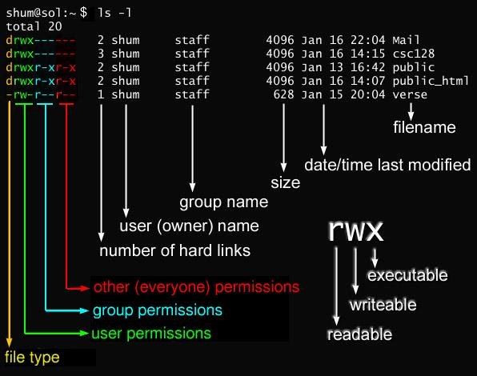
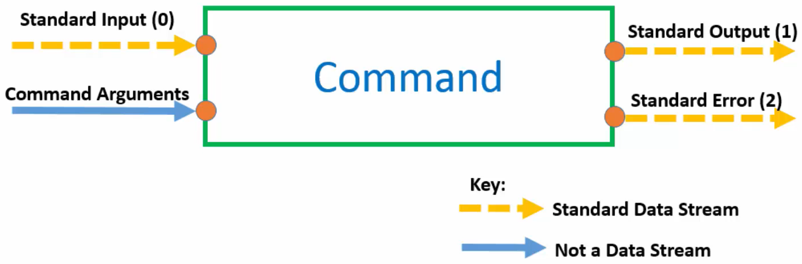

# Command Structure

By the end: Commands will begin to look like a langauge not random gibberish.

Right now each command has its own unique behavior. You can actually look up using something called the manual pages which I'll show you how to do later.

But the general command structure goes like this.
1. you type out the command name. So it would be like `date` or `echo`.
2. Then you give the comments of options to customize its behavior.
3. Then you give the command some inputs to actually operate on.

--> `command_name -options inputs`

## Command Name

Now the first thing you type is the command name. Now that lets the shell know what program you actually want to run. And once the Shell knows what program you want to run it knows the name of the program you want to run the show will then search for that program on something called your Shell's path which is just a list of folders that contain these programs.

Now you can actually see your Shell's path by typing `echo $PATH`. So what the shell will do is it'll start at the very left of the path and it will look inside that folder for a command called `echo`. If it's not found, it will do the same on the next folder and so on and so forth.

**Note**: If two programs with the same name are in different folders of `$PATH`, the one in the far left folder will always run.


Now you can actually see which folder the command is stored in by using the `which` command:
- `which cal` --> `/usr/bin/cal`
- `which date` --> `/usr/bin/date`

Now you can customize the way that commands work by giving them different **options** and different **inputs**.

## Inputs
It's important to note that not all commands actually require inputs. Some inputs are optional. For example the date command doesn't strictly require an input.

**Note**: Because commands **operate** on the input the input is sometimes called an **operand**.

So for example if we take the cow command I could just type cow OK and press enter and I would get this month's calendar. But to customize the behavior I can give it one or more inputs: `cal 2021`, `cal 12 2017`

## Options

That's common for commands to be preceded by dashes and hyphens and things: `cal -y`, `date -u` (UTC time)

So sometimes options actually have long form names proceded by `--`: `date --universal`

**Note:** The long form commands can make commands easier to read but they're not available for all options. It really depends upon the command that you're using.

Now the only other thing to know is that sometimes options can have their own inputs. For example there is an option that will allow us to see a certain amount of months after a time:
- `cal -A 1 12 2017` --> 1 month after (`-A`) December (12) 2017
- `cal -B 1 12 2017` --> 1 month before (`-B`) December (12) 2017
- `cal -A 1 -B 1 12 2017` --> 1 month after (`-A`) and before (`-B`) December (12) 2017

## Summary
- Command: `command_name -options inputs`
- Command name must be on the shell's **search path** (`$PATH`).
- Commands operate on inputs.
- Options modify command's behaviour


# Linux Manual

Like we saw each of the Linux commands is implemented slightly differently and they behave slightly differently.

So other than memorizing a jillion different implementations of things how can we actually know how to use each of the Linux commands properly. Well the answer is to use the manual pages known as **man pages** for sure.

## Manual Structure

Manual is broken up into eight sections and each of these sections deals with a specific type of thing.

|Section|Contains|Description|Example|
|:--|:--|:--|:--|
|1|User Commands|commands that can just be run from the shell by any regular user. You don't need any particular administration privileges or any root privileges to be able to run these|`date`, `cal`|
|2|System Calls|this contains programming functions that can be used within an application that you write to make calls to the Linux kernel which is a very low level part of the operating system||
|3|C Library Functions|hese are libraries for the C programming language and these are functions and libraries that provide interfaces to specific things on your computer such as graphical user interfaces or other libraries that you might want to use if you're writing some C code that you want to have access to your computer with||
|4|Devices and Special Files|This is about how the different device is on your computer are managed. So things such as CD drives or things such as random number generators or things such as U.S. ports and stuff like that.||
|5|File Formats and Conventions|It's about all the different formats and the conventions of specific files and on your computer. So you know formats for word documents or formats where PDA documents a format for specific configuration files.||
|6|Games|Any games that are installed on your computer they have their own section and different commands.||
|7|Miscellaneous|More miscellaneous stuff more Uncategorized stuff. So it's usually stuff like protocols or file systems and information about those.||
|8|System Administration|All the commands that can actually that actually require root privileges and administration privileges to be run on your computers this is things like changing passwords. This is things like you know really editing important stuff on your computer setting up automation and things like that.||


**Note:** Section 1 Section 5 and section 8 are what you will likely use most often.

## Search Manual

You would have to use the `man` command that a `man` command is short for the word manual. And it's the command that deals with everything to do with the manual basically: `man -k search_term`
- `man -k which`
- `man -k ls`
- ...

To see the manual for a command: `man command`:
- `man which`
- `man ls`
- ...

Example of a man page: `man which`

```
WHICH(1)                    General Commands Manual                   WHICH(1)                                                                                  NAME                                                                                   which - locate a command                                                                                                                                 SYNOPSIS                                                                               which [-a] filename ...                                                                                                                                  DESCRIPTION                                                                            which returns the pathnames of the files (or links) which would be exe‐         cuted in the current environment, had its arguments been given as  com‐         mands  in a strictly POSIX-conformant shell.  It does this by searching         the PATH for executable files matching the names of the  arguments.  It         does not canonicalize path names.                                                                                                                        OPTIONS                                                                                -a     print all matching pathnames of each argument  
EXIT STATUS                                                                            
0      if all specified commands are found and executable                                                                                                       1      if  one  or  more  specified commands is nonexistent or not executable                                                                                                                                                  2      if an invalid option is specified  
```

**Note**: in manual pages:
- Anything inside `<>` is **mandatory**.
- Anything inside `[]` is **optional**
    - For example:
        - in `which [-a] <something>`, `-a` is optional but `something` is mandatory.
        - in `ls [OPTION]... [FILE]...` everything is optional and only ls is mandatory.

- `|` inside `[]` means `or` which means you have to pick one of them not both. For example in `[-a | -f]` using `-af` is invalid


# Permissions
## Listing the Contents of a Directory with ls
The ls command lists the contents of the current directory.
```bash
$ ls /
bin   dev  home  lib    lib64   media  opt   root  sbin  srv  tmp  var
boot  etc  init  lib32  libx32  mnt    proc  run   snap  sys  usr
```

By itself, the ls command shows just a list of names. Some are files, some are directories. However, using ls in this matter has some limitations. First, it does not show hidden files. Hidden files use filenames that start with a period (.) as the first character. They are often used for configuration of specific programs and are not accessed frequently. For this reason, they are not included in a basic directory listing. You can see all the hidden files by adding a switch to the command like this:

```bash
$ ls -a
.   bin   dev  home  lib    lib64   media  opt   root  sbin  srv  tmp  var
..  boot  etc  init  lib32  libx32  mnt    proc  run   snap  sys  usr
```

There is still more information available about each item in a directory. To include details such as the file/directory permissions, owner and group (all of which are discussed later in this chapter), as well as the size, and the date and time it was last modified, enter the following:

```bash
$ ls -l
lrwxrwxrwx  1 root root      7 Aug  4  2020 bin -> usr/bin
drwxr-xr-x  1 root root   4096 Aug  4  2020 boot
drwxr-xr-x  1 root root   4096 Feb 20 13:28 dev
drwxr-xr-x  1 root root   4096 Feb 20 11:30 etc
drwxr-xr-x  1 root root   4096 Dec 20 06:31 home
-rwxr-xr-x  1 root root 631968 Dec 20 06:28 init
lrwxrwxrwx  1 root root      7 Aug  4  2020 lib -> usr/lib
lrwxrwxrwx  1 root root      9 Aug  4  2020 lib32 -> usr/lib32
lrwxrwxrwx  1 root root      9 Aug  4  2020 lib64 -> usr/lib64
lrwxrwxrwx  1 root root     10 Aug  4  2020 libx32 -> usr/libx32
drwxr-xr-x  1 root root   4096 Aug  4  2020 media
drwxr-xr-x  1 root root   4096 Dec 20 06:31 mnt
drwxr-xr-x  1 root root   4096 Aug  4  2020 opt
dr-xr-xr-x 30 root root      0 Feb 20 11:30 proc
drwx------  1 root root   4096 Jan 11 11:08 root
drwxr-xr-x  1 root root   4096 Feb 20 13:42 run
lrwxrwxrwx  1 root root      8 Aug  4  2020 sbin -> usr/sbin
drwxr-xr-x  1 root root   4096 Jul 10  2020 snap
drwxr-xr-x  1 root root   4096 Aug  4  2020 srv
dr-xr-xr-x 12 root root      0 Feb 20 11:30 sys
drwxrwxrwt  1 root root   4096 Feb 21 19:58 tmp
drwxr-xr-x  1 root root   4096 Aug  4  2020 usr
drwxr-xr-x  1 root root   4096 Aug  4  2020 var
```

The `ls -l` command displays a lot of information about the files in the directory:



File Type:
|Symbol|Type|
|--|--|
|`-`|regular file|
|`d`|directory|
|`l`|symbolic link|

## Permissions
- To read a file, you need to have read (`r`) permission for that file.
- To write to a file, to modify a file, or to erase a file, you need to have write (`w`) permission for that file.
- To run a program or to change to a directory, you need to have execute (`x`) permission for that program or directory.

You can find out your login name with the `whoami` command.
You can find out what groups you are in with the `groups` command.

- If you are the owner of a file (you made it, it's yours), then that file's **user** permissions take effect.
- If you are in the group that a file is assigned to, then that file's **group** permissions take effect.
- Otherwise, the file's **other** permissions take effect.

It is important that in most cases, it makes no sense to set permissions on yourself more restrictive than group or other.

It is also important to remember that permissions basically do not apply to the root user.

### Permission Categories
|Symbol|Category|
|--|--|
|`u`|User|
|`g`|Group|
|`o`|Other|
|`a`|All|

### Groups
- Every user is in at least one group
- Users belong to many groups
- Groups are used to organize users
- The `groups` command displays a user's groups


### Change Permissions
You can change the permissions on a file with the `chmod` command.

- `chmod`: change mode command
- `ugoa`: user category (user, group, other, all)
- `+-=`: add, subtract, or set permissions
- `rwx`: read write, execute

Examples:
```bash
$ ls -l sales.data
-rw-r--r-- 1 jason users 10400 Sep 27 08:52 sales.data
```

- Add write permission to group:
```bash
$ chmod g+w sales.data
$ ls -l sales.data
-rw-rw-r-- 1 jason users 10400 Sep 27 08:52 sales.data
```

- Revoke write permission from group:
```bash
$ chmod g-w sales.data
$ ls -l sales.data
-rw-r--r-- 1 jason users 10400 Sep 27 08:52 sales.data
```

- Add read, write, and execution permission to user:
```bash
$ chmod u+rwx,g-r sales.data
$ ls -l sales.data
-rwx---r-- 1 jason users 10400 Sep 27 08:52 sales.data
```

- Set everybody permission to read only:
```bash
$ chmod a=r sales.data
$ ls -l sales.data
-r--r--r-- 1 jason users 10400 Sep 27 08:52 sales.data
```

**Note:** If you don't specify anything after `=`, all permissions are revoked.

Revoke all permissions from other:
```bash
$ chmod o= sales.data
$ ls -l sales.data
-r--r----- 1 jason users 10400 Sep 27 08:52 sales.data
```

### Numeric Based Permissions
Many people find it easiset to set permissions using numbers, instead of letters. The numbers are represented like this in binary:

|r|w|x||
|--|--|--|--|
|0|0|0|Value for off|
|1|1|1|Binary value for on|
|4|2|1|Base 10 value for on|

|Octal|Binary|String|Description|
|--|--|--|--|
|0|000|`---`|no permissions|
|1|001|`--x`|execute only|
|2|001|`-w-`|write only|
|3|011|`-wx`|write and execute (2+1)|
|4|100|`r--`|read only|
|5|101|`r-x`|read and execute (4+1)|
|6|110|`rw-`|read and write (4+2)|
|7|111|`rwx`|read, write, and execute (4+2+1)|

**Note:** In permission order has meaning! read, write, and then execute.

||U|G|O|
|--|--|--|--|
|Symbolic|`rwx`|`r-x`|`r--`|
|Binary|111|101|100|
|Decimal|7|5|4|

### Commonly Used Permissions

|Symbolic|Octal||
|--|--|--|
|`-rwx------`|700|ensure that the file can be read, edited, and executed by the owner, but no one else|
|`-rwxr-xr-x`|755|allows everyone to execute the file, but only the user can edit|
|`-rw-rw-r--`|664|allows a group of people to modify a file and let others read it|
|`-rw-rw----`|660|allows a group of people to modify a file and NOT let others read it|
|`rw-r--r--`|644|allows everyone on the system to read the file, but only the user can edit|

Notes:
- For 777 (gives full permission) and 666, always ask if there is a better way to do that
- 777 gives full permission, anyone can make changes to the script or program and execute it. so if mallicious code was either inserted on purpose or by accident, it can cause trouble.
- If multiple people need access, consider creating a group and limit access to that group.

### Links

#### Hard Links

Directory entries point to data in the filesystem. There is nothing wrong with having two different entries point to the same data. This is called a hard link.

To make a hard link, use the ln command. The usage is similar to the `cp` command:
`ln existing_filename new_hard_link`

This will make a new file name entry in the same inode making the file have 2 names (links) that are the same file.

If you erase the original file, the data remains, since it is still linked to the new filename. You can see the number of hard links there are to a particular file in the `ls -l` listing, in the column to the right of the permissions.

**Note:** You can't make a hard link across filesystems. If two different directories refer to data on two different hard drives, then a hard link cannot be made from a file on one to a new file on the other.  Also, you can't make a hard link to a directory;  the only hard links to directories are the . and .. special directories.

#### Symbolic Links

Symbolic links are similar to hard links, but instead of the new file pointing to the same data as the existing file, the new file points to the existing filename .

To make a symbolic link , use the ln -s command:

`ln -s existing_filename new_sym_link`
Symbolic links don't point to the actual data on the filesystem, so if the original file is erased, then the symbolic link will still point to the now-erased original filename.

Symbolic links have advantages over hard links, and so are used much more often:

- Symbolic links can span filesystems; hard links cannot.
- Symbolic links can be made for directories; hard links cannot.
- Symbolic links can point to non-existent files; hard links cannot.
- Symbolic links Do have seperate inodes (needed because they can reside on seperate filesystems) hard links are just another name added into the inode of the same file.


# Command Input & Output

The ways **data** flows **into** and **out** of a **command**.

Be ready to connect commands.



Standard output is something called a standard data stream just like a stream of water data stream start somewhere and they end somewhere. **So where does standard output lead?**

Well **by default** standard output will lead to your terminal. So that's why when we type commands the output of the command appears on the screen.

The amazing thing about output data streams is that you can **redirect** where they go using a process imaginative imaginatively called redirection.

Similarly, standard input is a data stream and is by default connected to the keyboard. So it can be redirected as well.

That makes them so powerful you can simply pass the standard output stream from one command to the standard input stream of another then pass the standard output stream of that second command to the standard input stream of the third command and so on and so on until you build up a very powerful pipeline connecting outputs to inputs in this way is known as **piping** together commands and it's an incredibly important concept in Linux as it's what makes working with the command line so powerful and effective.


## Summary
- There are two ways to get data into commands and two ways to get data out.
    1. Command line arguments
    3. Standard Input
    2. Standard Output
    4. Standard Error
- Standard Input, Standard Output, and Standard Error are Standard Data Streams.
- Data streams can be redirected from their default locations to wherever you wish.
- You can redirect the standard output of one command to the standard input of another in a process know as **piping**.


# Redirection
- You will be able to **redirect the standard data streams**.

But by the end, you'll be able to redirect standard input standard output and standard error to your heart's content and you'll feel much more like a computer genius already.

## Examples
- `cat`:  `cat` needs standard input in order to run but because standard input is by default connected to the keyboard cat just sits there and waits for us to enter something on the keyboard.
- `cat 1> output.txt`: Every data stream not only has a name like standard outputs and imports on that, but it also has a number associated with it.
    - Standard Input is number zero.
    - Standard output is number one.
    - Standard error is number two.

Here, we are redirecting or changing the destination of standard output because standard output is number one.

- `cat -k bla 2> error.txt`: Redirect standard error data stream to error.txt
- `cat 0< input.txt 1> output.txt 2> error.txt`

**Notes:**
    - You don't actually even need to put the number 1 in `cat 1> output.txt` (default for output: 1).
    - You don't actually even need to put the number 0 in `cat 0< input.txt`> (default for input: 0).
    - Use two arrows to write to a file again using redirection without truncating it (`cat 1>> output.txt`)

## Summary
- Standard input, standard output, and standard error are data streams.
- Using redirection you can control where those streams **flow**.
    - Standard Input: 0
    - Standard Output: 1
    - Standard Error: 2
- `>` will overwrite a file before writing it.
- `>>` will append to what's already there.

**Read More**:
- [Redirections](https://www.gnu.org/software/bash/manual/html_node/Redirections.html)
- [BashGuide/InputAndOutput](http://mywiki.wooledge.org/BashGuide/InputAndOutput?#Redirection)

# Piping

What if you wanted to connect the standard output of one command so that it flowed into the standard input of another command? Well that's where **piping** comes.

Each Linux command is designed to do one task extremely well. So if you can continually pipe these highly specialized commands together and pass data between them, you can build advanced pipelines to do pretty much any task that you can think of.

**piping is all about connecting standard output of one command to standard input of another command.**

## Example
For example if you want to get the weekday from date command, this is one way to do it:
1. `date > date.txt`
2. `cut < date.txt --delimiter " " --fields 1`

It's very cool command but this this works but it's kind of clunky. OK first we're writing the standard output of the date command to a file which takes up space on our computer. Right then we have to read that file into the command.
- A lot more typing.
- Makes unnecessary files.
- Inefficient and awkward.

So instead we can pipe the standard output of the data command directly into the standard input of the cut command.
- `date | cut --delimiter " " --fields 1`

Or you can send the standard output to a file:
- `date | cut --delimiter " " --fields 1 > today.txt`
- `date | cut > today.txt --delimiter " " --fields 1`
- `date | cut --delimiter " "  > today.txt --fields 1`

Send the data from the command into yet another command (multiple piping):
- `date | cut --delimiter " " --fields 1 | command -options args`

Remember the data can't really go two places at once. For example, piping is broken here and only date standard output is stored in `date.txt`:
- `date > date.txt | cut --delimiter " " --fields 1`

## `tee` Command
`tee` - read from standard input and write to standard output and files.

How can we go about actually saving this information into a file but at the same time also pass it down into the pipeline?


- `date | tee fulldate.txt | cut --delimiter " " --fields 1`

You can also send the standard output to a file:
- `date | tee fulldate.txt | cut --delimiter " " --fields 1 > today.txt`
- `date | tee fulldate.txt | cut --delimiter " " --fields 1 | tee today.txt`

By `tee` command, you can actually pass data through your pipeline but also take snapshots of the data as it flows through and save those snapshots into a file.

The `tee` command is really useful because by doing normal redirection you break your pipeline but by using the command you can save data but still keep your pipeline flowing.

## `xarg` Command
What do you think will happen if I take the date command and pipe that into Echo?
- `date | echo`

this is a common mistake actually that people make when using pipelines for the first time they try to pipe things into Echo.
**`echo` doesn't accept standard input.**

the key is to convert the data from standard input into command line arguments so the command can continue to work like normal.

- `date | xargs echo`
- `date | xargs echo "hello world"`
- `date | cut --delimiter " " --fields | xargs echo`

`rm` is another command that delets files and directories:
- `rm file`
- `rm -r directory`

Now create a file that contains two file names and name it `filestodelete.txt`.
```
file_1.txt
file_2.txt
```

This does not work to delete files:
- `cat filestodelete.txt | rm`

But this workds:
- `cat filestodelete.txt | xargs rm`

It's as if we run this command:
- `rm file_1.txt file_2.txt`

## Summary
- Piping connects **STDOUT** of one command to **STDIN** of another.
- Redirection of **STDOUT** breaks pipelines.
- To save a data snapshot without breaking pipelines, use the `tee` command.
- If a command does not accept **STDIN**, but you want to pipt to it, use `xargs`.
- Command you use with `xargs` can still have their own arguments.

# Aliases

Linux users often need to use one command over and over again. Typing or copying the same command again and again reduces your productivity and distracts you from what you are actually doing.

You can save yourself some time by creating **aliases** for your most used commands. **Aliases** are like custom shortcuts used to represent a command (or set of commands) executed with or without custom options. Chances are you are already using aliases on your Linux system.

## List Currently Defined Aliases in Linux
You can see a list of defined aliases on your profile by simply executing `alias` command.


## How to Create Aliases in Linux

Creating aliases is relatively easy and quick process. You can create two types of aliases – temporary ones and permanent. We will review both types.

### Creating Temporary Aliases
What you need to do is type the word alias then use the name you wish to use to execute a command followed by "=" sign and quote the command you wish to alias.

`alias shortName="your custom command here"`

For example:
`alias ls="ls -l"`

### Creating Permanent Aliases

To keep aliases between sessions, you can save them in your user’s shell configuration profile file. This can be:

```
Bash – ~/.bashrc
ZSH – ~/.zshrc
Fish – ~/.config/fish/config.fish
```

The syntax you should use is practically the same as creating a temporary alias. The only difference comes from the fact that you will be saving it in a file this time. So for example, in bash, you can open `.bashrc` file with your favorite editor like this:

`code ~/.bashrc`

Find a place in the file, where you want to keep the aliases. For example, you can add them in the end of the file. For organizations purposes you can leave a comment before your aliases something like this:

```
# my custom aliases
alias home="ssh -i ~/.ssh/mykep.pem tecmint@192.168.0.100"
alias ll="ls -alF"
```

**Note:** If you are using [zsh](https://linuxhint.com/install_zsh_shell_ubuntu_1804/), then you should open `~/.zshrc` file.


## Summary

- An alias is a custom nickname for a command or pipeline.
- aliases are accessible when you restart your terminal.
